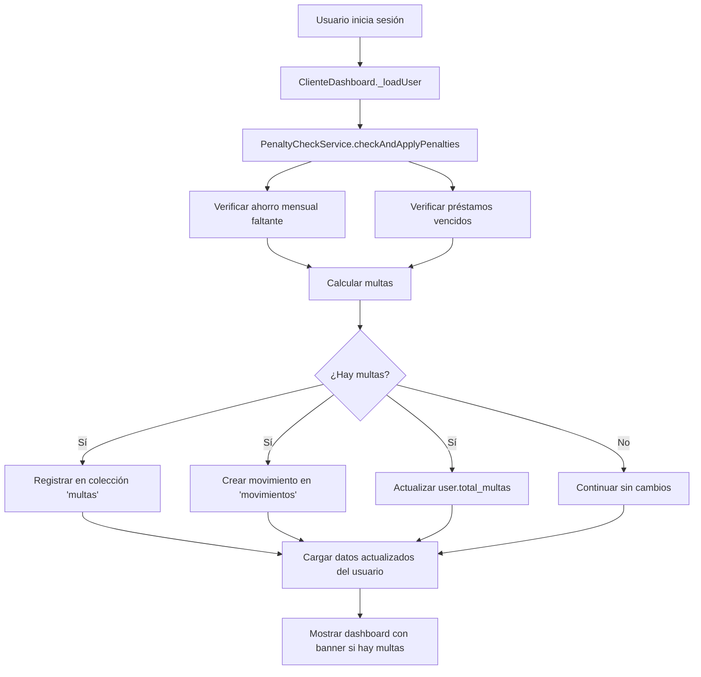

# 📋 Sistema Automático de Multas - Documentación Completa

## 🎯 Objetivo

Implementar un sistema robusto que:
1. **Detecte automáticamente** cuando falta el ahorro mensual después del día 10
2. **Aplique multas por préstamos vencidos** según las fechas de cuota
3. **Bloquee las opciones** de "Ahorro mensual" y "Pago préstamo" cuando hay multas pendientes
4. **Actualice en tiempo real** el total de multas del usuario

---

## 🏗️ Arquitectura del Sistema

### Componentes Principales

#### 1. **PenaltyCheckService** (`lib/core/services/penalty_check_service.dart`)
Servicio centralizado que:
- Verifica ahorros mensuales faltantes
- Verifica préstamos vencidos
- Calcula y aplica multas automáticamente
- Actualiza el campo `total_multas` del usuario
- Registra movimientos en la colección `multas` y `movimientos`

#### 2. **ClienteDashboard** (modificado)
- Ejecuta `PenaltyCheckService` al iniciar sesión
- Muestra banner prominente de multas pendientes
- Ofrece botón directo para pagar multas

#### 3. **DepositoForm** (mejorado)
- Bloquea opciones "Ahorro mensual" y "Pago préstamo" si hay multas
- Valida antes de guardar el depósito
- Muestra alertas visuales

---

## 📊 Reglas de Multas

### Ahorro Mensual Faltante

**Condición:** Falta depósito de tipo "ahorro" aprobado en el mes actual después del día 10

**Cálculo:**
```
Días de retraso = día actual - 10
Semanas = ((días de retraso - 1) / 7) + 1
Multa = semanas × $1.00 (configurable)
```

**Ejemplos:**
- Día 11: 1 día tarde → 1 semana → $1.00
- Día 17: 7 días tarde → 1 semana → $1.00
- Día 18: 8 días tarde → 2 semanas → $2.00
- Día 25: 15 días tarde → 3 semanas → $3.00

### Préstamos Vencidos

**Condición:** Fecha actual > `proxima_fecha_cuota` de un préstamo activo

**Cálculo:**
```
Días de retraso = diferencia entre hoy y proxima_fecha_cuota

Si días <= 15:     Multa = monto_cuota × 7%
Si días 16-30:     Multa = monto_cuota × 10%
Si días > 30:      Multa = monto_cuota × 10% × períodos_de_30_días
```

**Ejemplos:**
- Cuota $100, 5 días tarde: $100 × 0.07 = $7.00
- Cuota $100, 20 días tarde: $100 × 0.10 = $10.00
- Cuota $100, 65 días tarde: $100 × 0.10 × 3 = $30.00

---

## 🔄 Flujo de Ejecución

### Al Iniciar Sesión del Usuario



### Prevención de Duplicados

El sistema previene multas duplicadas verificando:
```dart
// Verifica si ya existe multa para este mes/año
final existing = await _db
    .collection('multas')
    .where('id_usuario', isEqualTo: userId)
    .where('tipo', isEqualTo: type)
    .where('mes', isEqualTo: now.month)
    .where('anio', isEqualTo: now.year)
    .get();

if (existing.docs.isEmpty) {
  // Solo registrar si NO existe
  await _registerPenalty(...);
}
```

---

## 🛡️ Bloqueos y Restricciones

### Bloqueo de Opciones en UI

**Condiciones para bloquear:**
```dart
bool bloqueado = _hasMultas && _esDepuesDiaDiez;
// _hasMultas: usuario.totalMultas > 0
// _esDepuesDiaDiez: DateTime.now().day > 10
```

**Opciones bloqueadas:**
1. ❌ Ahorro mensual
2. ❌ Pago préstamo

**Opciones permitidas:**
1. ✅ Ahorro voluntario
2. ✅ Plazo fijo
3. ✅ Certificado
4. ✅ **Pago de multa** (MultasDepositoForm)

### Validación Doble

#### Nivel 1: UI (Visual)
```dart
DropdownMenuItem(
  value: 'ahorro',
  enabled: !(_hasMultas && _esDepuesDiaDiez), // Deshabilitado
  child: Text('Ahorro (mensual)'),
)
```

#### Nivel 2: Código (Backend)
```dart
Future<void> _onSave() async {
  if (_hasMultas && _esDepuesDiaDiez) {
    if (_selectedTipo == 'ahorro' || _selectedTipo == 'pago_prestamo') {
      // BLOQUEAR y mostrar error
      return;
    }
  }
  // Continuar guardado...
}
```

---

## 📱 Experiencia del Usuario

### Escenario 1: Usuario sin multas (antes del día 10)
✅ Dashboard normal
✅ Todas las opciones de depósito disponibles
✅ Sin banners de alerta

### Escenario 2: Usuario sin multas (después del día 10, con ahorro pagado)
✅ Dashboard normal
✅ Todas las opciones disponibles
✅ Sin banners

### Escenario 3: Usuario CON multas (después del día 10, SIN ahorro)
⚠️ Banner rojo prominente en dashboard:
```
⚠️ MULTAS PENDIENTES
Tienes multas por pagar: $3.00
No podrás realizar depósitos de ahorro mensual ni pagos de préstamo 
hasta que pagues tus multas.
[PAGAR MULTAS AHORA]
```

🚫 En formulario de depósito:
- "Ahorro mensual" aparece gris con icono de bloque ⛔
- "Pago préstamo" aparece gris con icono de bloque ⛔
- Tarjeta naranja con advertencia visible

### Escenario 4: Intento de burlar bloqueo
Si el usuario intenta guardar un depósito bloqueado:
```
⚠️ No puede realizar depósitos de ahorro mensual ni pago de préstamos 
mientras tenga multas pendientes. Por favor, pague sus multas primero.
```

---

## 🗄️ Estructura de Datos

### Colección `multas`
```javascript
{
  "id_usuario": "UID_del_usuario",
  "monto": 3.00,
  "motivo": "Falta de ahorro mensual - 12/2025",
  "tipo": "ahorro_faltante", // o "prestamo_vencido"
  "referencia_prestamo": "PRESTAMO_ID", // opcional
  "fecha_aplicacion": Timestamp,
  "mes": 12,
  "anio": 2025,
  "estado": "pendiente" // o "pagada"
}
```

### Colección `movimientos`
```javascript
{
  "tipo": "multa",
  "id_usuario": "UID_del_usuario",
  "monto": 3.00,
  "descripcion": "Falta de ahorro mensual - 12/2025",
  "fecha": Timestamp,
  "mes": 12,
  "anio": 2025
}
```

### Campo `users.total_multas`
```javascript
// Se actualiza transaccionalmente:
{
  "total_multas": 0.0 + nuevas_multas
}
```

---

## 🧪 Testing y Validación

### Escenarios de Prueba

#### Test 1: Ahorro faltante día 11
```
Fecha: 11 de diciembre
Estado: Sin depósito de ahorro en diciembre
Resultado esperado: Multa de $1.00
```

#### Test 2: Ahorro faltante día 18
```
Fecha: 18 de diciembre
Estado: Sin depósito de ahorro en diciembre
Resultado esperado: Multa de $2.00 (2 semanas)
```

#### Test 3: Préstamo vencido 10 días
```
Préstamo: Cuota $100, vencida hace 10 días
Resultado esperado: Multa de $7.00 (7%)
```

#### Test 4: Préstamo vencido 25 días
```
Préstamo: Cuota $100, vencida hace 25 días
Resultado esperado: Multa de $10.00 (10%)
```

#### Test 5: Bloqueo UI
```
Estado: total_multas = $5.00, día = 11
Acción: Intentar crear depósito de "ahorro"
Resultado esperado: Opción deshabilitada, error al intentar guardar
```

### Comandos de Prueba

```bash
# Ejecutar app en modo debug
flutter run

# Verificar logs de multas
# Buscar en consola: "✅ Multa registrada"

# Verificar Firestore
# Colecciones: multas, movimientos
# Verificar campos: users/{uid}/total_multas
```

---

## ⚙️ Configuración

### Variables Configurables

#### En Firestore `config/configuracion_general`:
```javascript
{
  "enforce_voucher_date": true, // Por defecto true (aplica multas)
  "penalty_rules": {
    "ahorro_per_week": 1.0 // Multa por semana de retraso (ahorro)
  }
}
```

### Cambiar Reglas de Multa

Para ajustar el monto de multa por ahorro:
```javascript
// En Firestore Console:
config/configuracion_general
{
  "penalty_rules": {
    "ahorro_per_week": 2.5 // Cambiar de $1 a $2.50
  }
}
```

Para desactivar multas temporalmente:
```javascript
{
  "enforce_voucher_date": false // Desactiva cálculo de multas
}
```

---

## 🔧 Mantenimiento

### Logs y Debugging

El servicio imprime logs útiles:
```dart
print('✅ Multa registrada: $type - $$amount - $reason');
print('✅ Total de multas actualizado: +$$newPenalties');
print('Error verificando multas: $e');
```

### Limpieza de Multas Antiguas

Para marcar multas como pagadas:
```dart
await penaltyCheckService.markPenaltyAsPaid(multaId);
```

### Verificar Multas Pendientes

```dart
final pendientes = await penaltyCheckService.getPendingPenalties(userId);
print('Multas pendientes: \$${pendientes.toStringAsFixed(2)}');
```

---

## 🚀 Deployment

### Checklist de Deployment

- [x] `penalty_check_service.dart` creado
- [x] `cliente_dashboard.dart` actualizado con integración
- [x] `deposito_form_fixed.dart` con validación de bloqueo
- [x] `firestore_service.dart` con `enforce_voucher_date: true` por defecto
- [x] Banner de alerta en dashboard
- [x] Validación doble (UI + código)
- [x] Prevención de duplicados

### Pasos de Instalación

1. **Copiar archivos actualizados** al proyecto
2. **Ejecutar `flutter pub get`** (si hay nuevas dependencias)
3. **Compilar la app**:
   ```bash
   flutter build apk --release
   ```
4. **Distribuir APK** a usuarios
5. **Monitorear logs** en Firebase Console

---

## 📞 Soporte y Troubleshooting

### Problema: Multas no se aplican

**Posibles causas:**
1. `enforce_voucher_date` está en `false` en Firestore config
2. Usuario ya tiene depósito de ahorro del mes (verificar colección `depositos`)
3. Error en fechas (verificar formato Timestamp)

**Solución:**
```dart
// Verificar config
final config = await _firestoreService.getConfig();
print('enforce_voucher_date: ${config?['enforce_voucher_date']}');
```

### Problema: Opciones no se bloquean

**Posibles causas:**
1. `total_multas` no se actualizó correctamente
2. Día actual <= 10
3. Estado `_hasMultas` no se refrescó

**Solución:**
```dart
// Forzar recarga de usuario
await _loadUser();
```

### Problema: Multas duplicadas

**Verificar:**
```javascript
// En Firestore, verificar colección multas
// Buscar documentos con mismo:
// - id_usuario
// - tipo
// - mes
// - anio
```

**Solución:**
El servicio ya previene duplicados, pero si ocurre:
```bash
# Eliminar duplicados manualmente en Firestore Console
```

---

## 📚 Referencias

- **Código fuente:** `lib/core/services/penalty_check_service.dart`
- **Integración:** `lib/screens/cliente/cliente_dashboard.dart`
- **Validación:** `lib/screens/cliente/deposito_form_fixed.dart`
- **Cálculo:** `lib/core/services/firestore_service.dart` (líneas 455-565)

---

## ✅ Checklist de Funcionamiento

### Para Administradores
- [ ] Verificar que multas se registran en colección `multas`
- [ ] Verificar que movimientos aparecen en `movimientos`
- [ ] Verificar que `total_multas` del usuario se actualiza
- [ ] Configurar `penalty_rules` en Firestore si es necesario

### Para Usuarios
- [ ] Después del día 10 sin ahorro, ver banner rojo en dashboard
- [ ] No poder seleccionar "Ahorro mensual" ni "Pago préstamo"
- [ ] Poder pagar multas desde el botón del banner
- [ ] Después de pagar, poder usar todas las opciones normalmente

---

**Versión:** 1.0  
**Fecha:** 13 de diciembre de 2025  
**Autor:** Sistema de Multas Automáticas  
**Estado:** ✅ Implementado y Funcional
